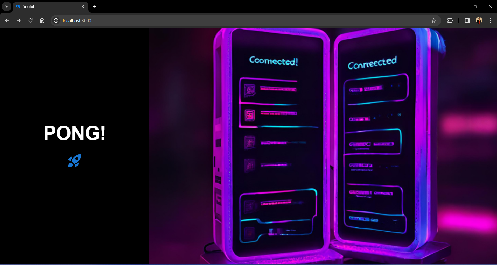
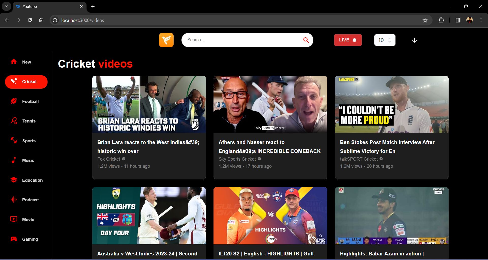
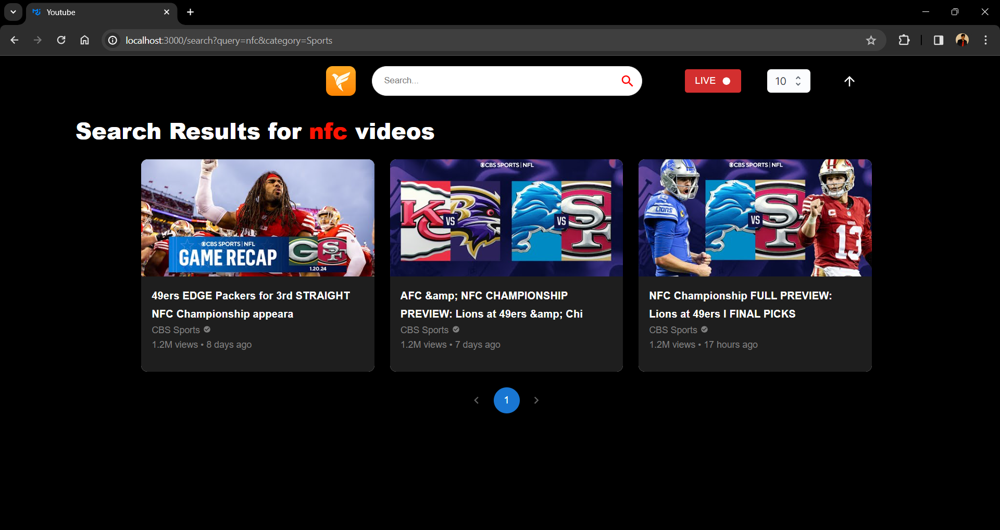

# youtubeCrawler

To make an API to fetch latest videos sorted in reverse chronological order of their publishing date-time from YouTube for a given tag/search query in a paginated response.

# Basic Requirements

- [x] Server should call the YouTube API continuously in background (async) with some interval (say 10 seconds) for fetching the latest videos for a predefined search query and should store the data of vid eos (specifically these fields - Video title, description, publishing datetime, thumbnails URLs and any other fields you require) in a database with proper indexes.
- [x] A GET API which returns the stored video data in a paginated response sorted in descending order of published datetime.
- [x] A basic search API to search the stored videos using their title and description.
- [x] It should be scalable and optimised.

# Tech Stack


# Reference

* [YouTube data v3 API](https://developers.google.com/youtube/v3/getting-started)
* [Search API reference](https://developers.google.com/youtube/v3/docs/search/list)
* [Golang Youtube](https://pkg.go.dev/google.golang.org/api@v0.157.0/youtube/v3)


# Running the Backend

- Clone the repo:
  
  ```bash
  git clone https://github.com/harshithvh/youtubeCrawler.git
  
- Open directory in terminal:

  ```bash
  cd youtubeCrawler/backend

- Create a .env file:

  ```bash
  API_KEYS=KEY1,KEY2
  MONGO_URI=mongodb://{HOST}:{PORT}/
  DATABASE_NAME=DATABASE_NAME
  COLLECTION_NAME1=COLLECTION_NAME1
  COLLECTION_NAME2=COLLECTION_NAME2

- Install project dependencies:

  ```bash
  go get -u ./...

- Fire up the server:

  ```bash
   go run main.go

- Access api at:

  ```bash
  http://localhost:8080/

# Running the Frontend

- Open directory in terminal:

  ```bash
  cd youtubeCrawler/frontend

- Install project dependencies:

  ```bash
  npm install 

- Launch the frontend

  ```bash
  npm run dev

- Access the dashboard at:

  ```bash
  http://localhost:3000/

# Running with Docker

- Build Docker images:

  ```bash
  docker build -t {image} .

- Launch and run containers:

  ```bash
  docker run -p {port:port} {image}

# APIs

- GET  
  - endpoint: `/ping`
  - response: `{"message":"pong"}`
  - query: http://localhost:{port}/

- GET
  - endpoint: `/videos`
  - response: `{"pagination": {"currentPage": int, "pageSize": int, "totalPages": int, "totalVideos": int}, "videos": [{}video]}`
  - query: http://localhost:{port}/videos?page=1&pageSize=5&catergory={COLLECTION_NAME}
  - query params:

| param    | required  | type |  default  |
| -----    | --------- | ---- | --------  | 
| page     |  false    | int  |    1      |
| pageSize |  false    | int  |    10     |
| sort     |  false    | int  |    -1     |
| category |  true     | str  |           |

- GET
  - endpoint: `/search`
  - response: `{"pagination": {"currentPage": int, "pageSize": int, "totalPages": int, "totalVideos": int}, "videos": [{}video]}`
  - query: http://localhost:{port}/search?query={xxx}&page=1&pageSize=5&catergory={COLLECTION_NAME}
  - query params:

| param    | required  | type |  default  |
| -----    | --------- | ---- | --------  | 
| page     |  false    | int  |    1      |
| pageSize |  false    | int  |    10     |
| sort     |  false    | int  |    -1     |
| query    |  true     | str  |           |
| category |  true     | str  |           |

- GET
  - endpoint: `/start-fetching`
  - response: `{"message":"Background Task Initiated"}`
  - query: http://localhost:{port}/start-fetching?category={COLLECTION_NAME}
  - query params:

| param    | required  | type |  default  |
| -----    | --------- | ---- | --------  | 
| category |  true     | str  |           |

- GET
  - endpoint: `/stop-fetching`
  - response: `{"message":"Background Task Terminated"}`
  - query: http://localhost:{port}/stop-fetching

# Screenshots

## Ping Server



## Home Page



## Search Page


